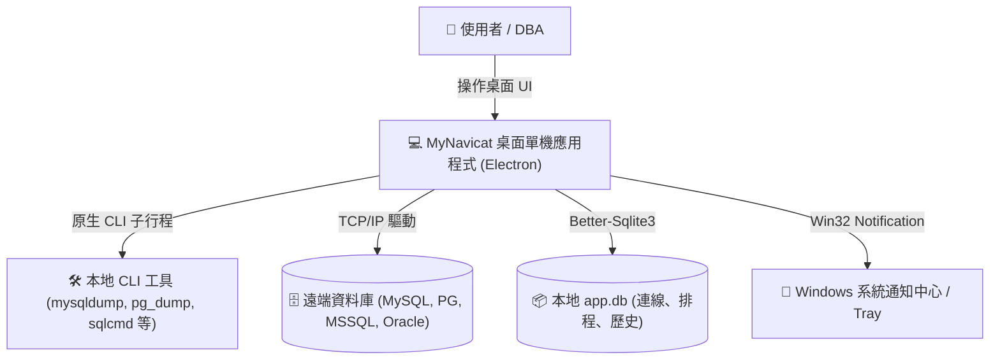
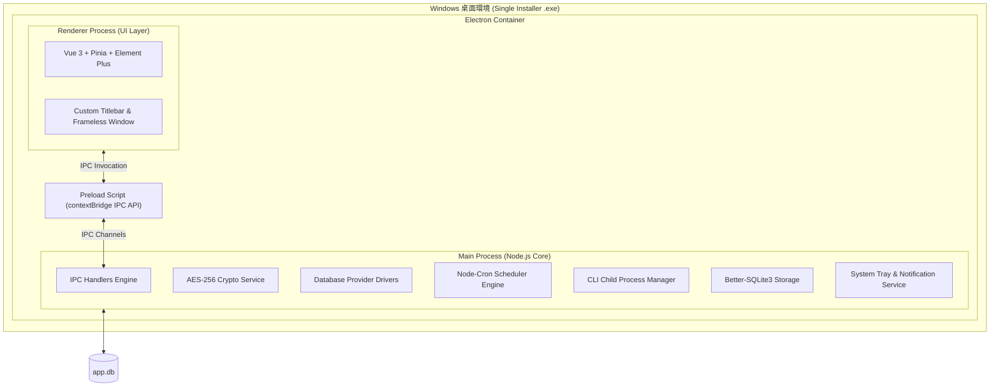
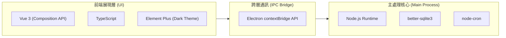
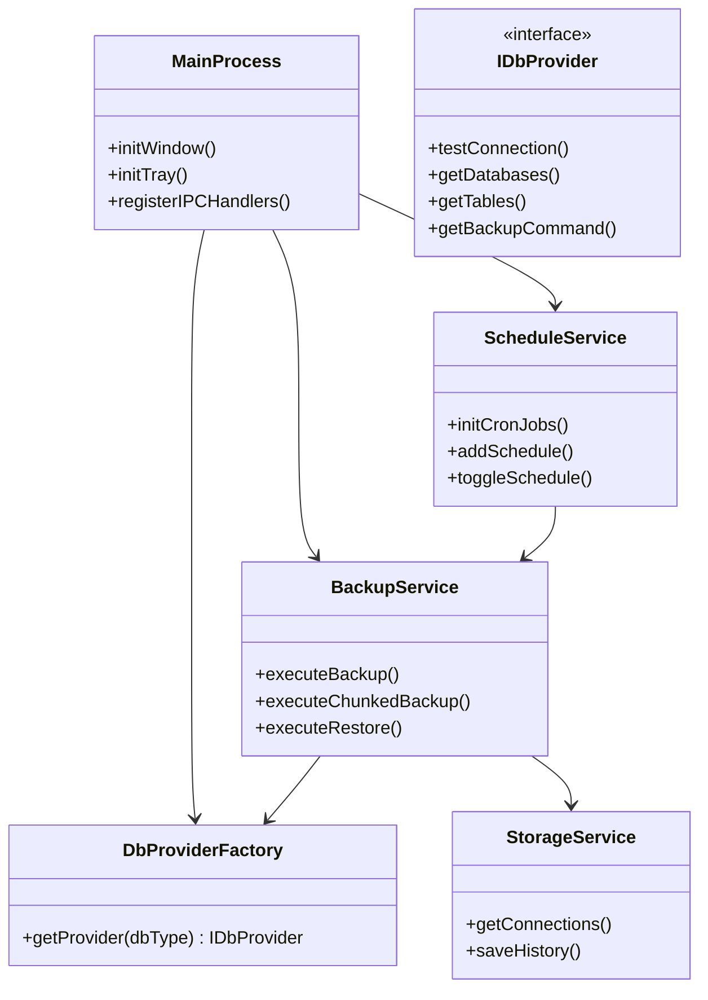
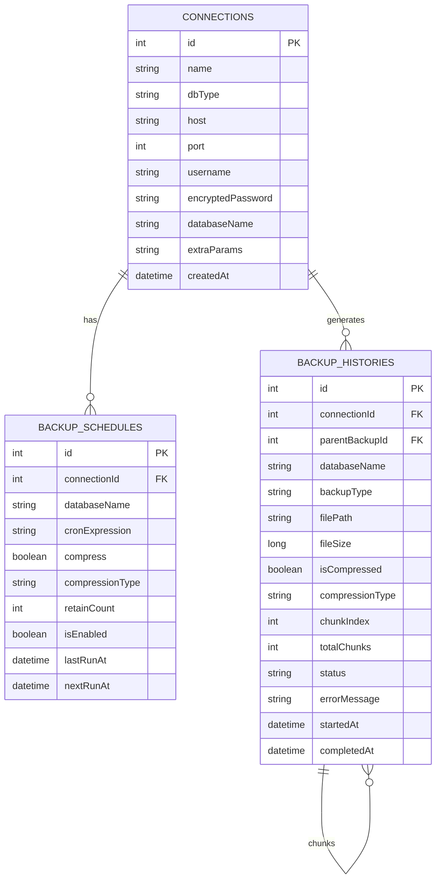
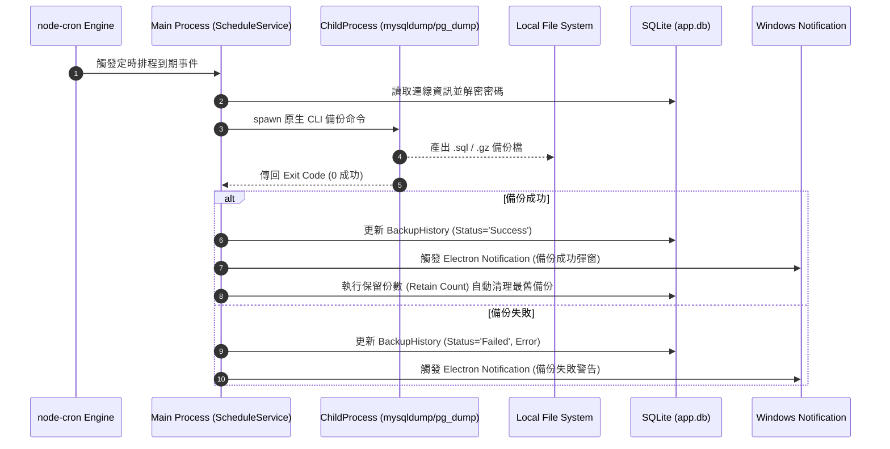
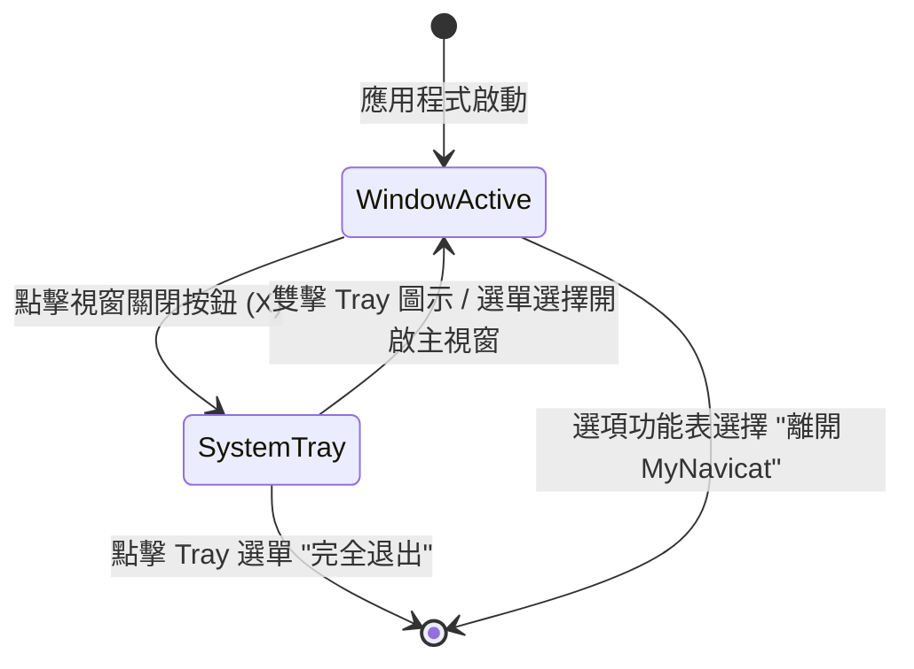
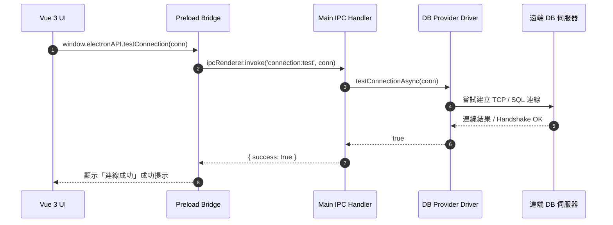
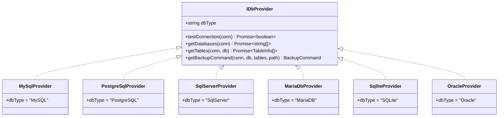
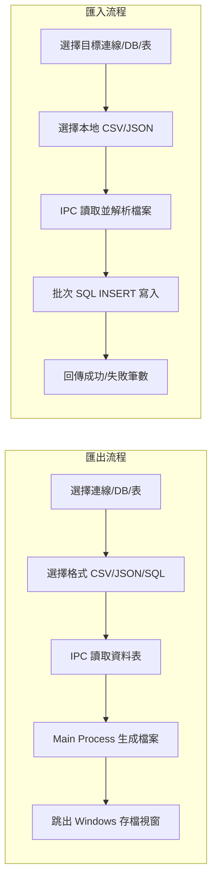

# MyNavicat — SQL 資料庫備份與管理工具 桌面單機版 Spec (v2.0 Electron Refactor)

## Problem Statement

DBA 和開發者日常需要對多種資料庫（MySQL、PostgreSQL、SQL Server、MariaDB、SQLite、Oracle）進行備份、還原、排程維護、資料瀏覽與匯出入等操作。
原本的 Web 架構需要同時執行 ASP.NET Core 與 Vue 開發伺服器，且容易遇到本地 Port 衝突或瀏覽器權限限制。使用者需要一個**完全單機運行的桌面應用程式 (Desktop App)**，雙擊即可開啟，免去配置 Web 伺服器與開關瀏覽器的麻煩，且關閉視窗後能縮小至 Windows 系統工具列 (System Tray) 繼續執行排程備份。

## Solution

將 **MyNavicat** 重構為 **Electron 桌面單機應用程式** (Electron + Vue 3 + TypeScript + Node.js Native API)。

- **完全移除 ASP.NET Core 後端**：所有資料庫連線驅動（`mysql2`, `pg`, `tedious`, `better-sqlite3`, `oracledb`）、AES-256 加密、CLI 子行程啟動、定時排程、檔案分片處理均收合至 **Electron Main Process (Node.js)** 中處理。
- **無縫 IPC 通訊**：Renderer Process (Vue 3 + Element Plus) 透過安全的 `contextBridge` / `ipcRenderer` 與 Main Process 通訊。
- **Windows 原生體驗**：
  - **Frameless Window**：客製化深色風格標題列（縮小、放大、關閉按鈕）。
  - **System Tray 系統列常駐**：關閉視窗時自動縮小至系統列，確保排程備份不中斷；右鍵可顯示快節選單或完全退出。
  - **Windows 原生通知**：備份完成/失敗時透過 Electron `Notification` 彈出 Windows 系統通知中心。
- **打包發佈**：使用 `electron-builder` 打包為 Windows **NSIS (.exe)** 安裝檔，包含自動建立桌面捷徑與解安裝功能。

---

## Mermaid 架構與設計圖表

### 1. 系統脈絡圖 (System Context Diagram)


### 2. 容器與部署概觀 (Container & Deployment Overview)


### 3. 架構與選型圖 (Architecture & Tech Stack)


### 4. 模組關係圖 (Module Relationships)


### 5. 資料模型 (Data Model / ER Diagram)


### 6. 關鍵流程：排程備份與系統通知 (Key Process Flow)


### 7. 備份檔案分片與還原流程圖 (Chunked Backup Flowchart)
```mermaid
flowchart TD
    Start([開始備份]) --> ExecCLI[執行 CLI 產生完整備份檔]
    ExecCLI --> CheckSize{檔案大小 > Chunk 閥值?}
    CheckSize -- 否 --> SaveNormal[儲存單一備份檔紀錄] --> End([完成])
    CheckSize -- 是 --> Split[拆分檔案成 .part1, .part2...]
    Split --> DeleteRaw[刪除原始巨型檔案]
    DeleteRaw --> SaveParentDB[寫入父備份歷史紀錄 (BackupType='Chunked')]
    SaveParentDB --> SaveChunksDB[寫入各 Part 子紀錄]
    SaveChunksDB --> End

    RestoreStart([開始還原 Chunked 備份]) --> QueryChunks[查詢所有 Parts 檔案路徑]
    QueryChunks --> SortParts[依 ChunkIndex 排序]
    SortParts --> MergeParts[流式合併 Part 檔至暫存檔]
    MergeParts --> CheckCompress{是否壓縮檔?}
    CheckCompress -- 是 --> Decompress[解壓縮至 SQL 檔]
    CheckCompress -- 否 --> ExecRestore[執行 CLI 還原命令]
    Decompress --> ExecRestore
    ExecRestore --> CleanTemp[清理暫存檔] --> RestoreEnd([還原完成])
```

### 8. 視窗與系統列生命週期狀態圖 (Window & Tray State Diagram)


### 9. 序列圖：連線測試與資料庫瀏覽 (Sequence Diagram)


### 10. 類別圖：DB Provider 工廠模式 (Class Diagram)


### 11. 流程圖：資料匯出與匯入流程 (Export/Import Flowchart)


### 12. 虛擬碼與 IPC API Signature Preview
```typescript
// Preload Bridge API Contract
interface IElectronAPI {
  // 連線管理
  getConnections: () => Promise<Connection[]>;
  saveConnection: (conn: ConnectionDto) => Promise<Connection>;
  deleteConnection: (id: number) => Promise<boolean>;
  testConnection: (conn: ConnectionDto) => Promise<boolean>;
  
  // 瀏覽與中繼資料
  getDatabases: (connectionId: number) => Promise<string[]>;
  getTables: (connectionId: number, database: string) => Promise<TableInfo[]>;
  getTableSchema: (connectionId: number, database: string, table: string) => Promise<TableSchema>;
  getTableData: (connectionId: number, database: string, table: string, page: number, pageSize: number) => Promise<PagedResult>;
  
  // 備份與還原
  executeBackup: (req: BackupRequest) => Promise<BackupHistory>;
  executeRestore: (req: RestoreRequest) => Promise<boolean>;
  getBackupHistories: (connectionId?: number) => Promise<BackupHistory[]>;
  
  // 排程管理
  getSchedules: () => Promise<BackupSchedule[]>;
  saveSchedule: (schedule: ScheduleDto) => Promise<BackupSchedule>;
  toggleSchedule: (id: number, enabled: boolean) => Promise<boolean>;
  
  // 視窗控制
  minimizeWindow: () => void;
  maximizeWindow: () => void;
  closeWindow: () => void;
}
```

---

## User Stories

1. ** As an DBA**, I want to run MyNavicat as a single desktop application without starting a local web server, so that I can open and use it immediately with zero setup.
2. **As an DBA**, I want a frameless window with a dark custom titlebar, so that the application feels native and visually integrated.
3. **As an DBA**, I want closing the window to minimize the application to the Windows System Tray, so that background scheduled backups continue to run without interruption.
4. **As an DBA**, I want native Windows desktop notifications when a scheduled backup completes or fails, so that I get real-time alerts without keeping the window in focus.
5. **As an DBA**, I want to create, test, edit, and delete database connections for 6 major database types with AES-256 encrypted password storage.
6. **As an DBA**, I want to browse database tables, schemas, primary keys, and data rows seamlessly within the desktop UI.
7. **As an DBA**, I want to perform full or partial backups compressed in GZIP or ZIP format.
8. **As an DBA**, I want large databases to be automatically split into chunked backup files (.part1, .part2), so that I can manage giant databases easily.
9. **As an DBA**, I want to configure cron scheduled backups with automatic retention cleanup for old backup files.
10. **As an DBA**, I want to export table data to CSV, JSON, or SQL INSERT files and import data from CSV or JSON files.

---

## Implementation Decisions

1. **純 Electron 單機架構**：完全移除 ASP.NET Core，以 Electron Main Process + Node.js 擔當伺服核心與平臺 API 通訊。
2. **IPC 安全對接**：開放 Context Isolation，使用 Preload Script 透過 `contextBridge` 對外提供限縮安全的 API 通道。
3. **本地儲存引擎**：選用 `better-sqlite3` 建立本地元資料庫 (`app.db`)，資料檔位於用戶系統 `AppData/Roaming/MyNavicat/`。
4. **排程引擎**：採用 `node-cron` 在 Electron Main Process 執行背景計時任務。
5. **通知系統**：呼叫 Electron 原生 `Notification` API 與系統通知中心聯動。
6. **打包安裝檔**：使用 `electron-builder` 打包產出 Windows NSIS (.exe) 綠色/安裝精靈檔案。

---

## Testing Decisions

1. **單元測試**：使用 Vitest 測試 `cryptoService`, 6 大 `DbProvider` 實作, `StorageService` SQL 語法與分片切分 logic。
2. **IPC 模組測試**：驗證 Main Process IPC Handler 輸入驗證與異常捕獲。
3. **端對端 GUI 測試**：使用 Spectron / Playwright for Electron 測試視窗操作、功能表及畫面的切換流暢度。

---

## Out of Scope

1. macOS 及 Linux 打包檔（第一階段僅發佈 Windows NSIS .exe）。
2. 多使用者存取控制及遠端 Web 控制台。

